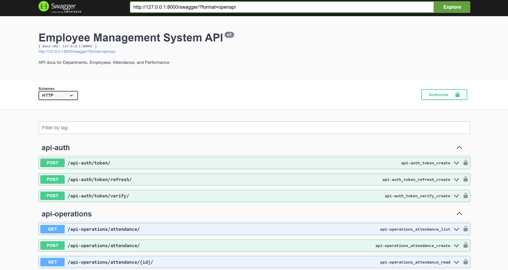
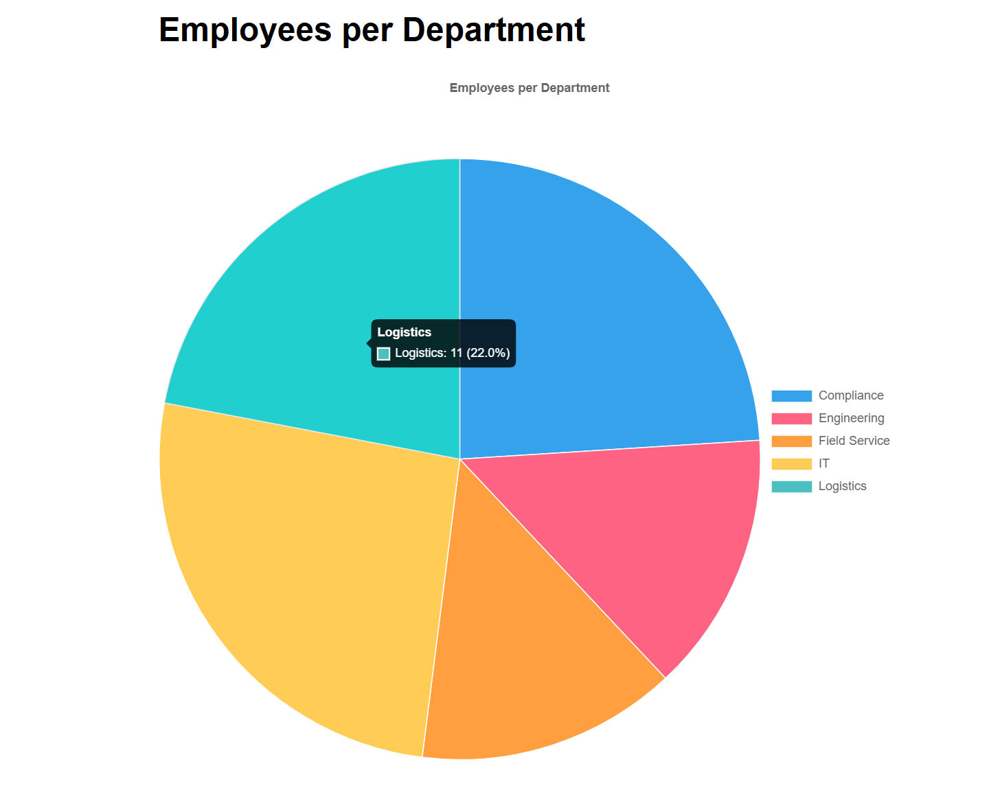
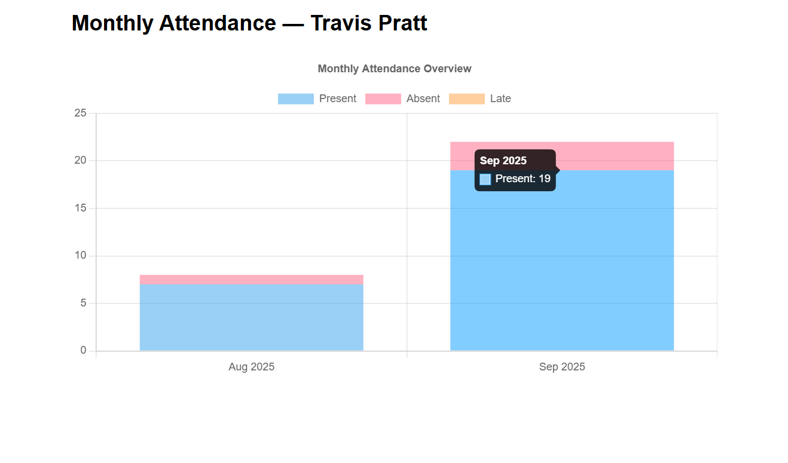

# django_REST_ems 

## Introduction
A simple Django REST web application backed by PostgreSQL, structured with good practices and useful extras for debugging, documentation, and containerized deployment. This repository can serve as a reference for future Django projects.

The basic Employee Management System has four models.

    * Department
        - name
    * Employee
        - name, Email, Phone Number, Address, Date of Joining Department (FK)
    * Attendance
        - Employee (FK), Date, Status (Present/Absent/Late)
    * Performance
        - Employee (FK), Rating (1-5), Review Date

These models are defined with appropriate indexes for efficient queries for the postgres database accompanying this.

## Setup
Given that postgres is avaiable, the system can be setup locally in a venv with:
    
    pip install -r requirements.txt

More appropriate would be to use Docker. The compose file defines a webapp service and a postgres database service. With both, the system can run smoothly. The .env contains the necessary environment variables including the connection information for postgres and creating a superuser for the Django system initially. Feel free to modify the values as intended, but the names should not be changed.

Afterwards a simple docker compose up would start the services:
    
    docker compose up

Or more manually, run these three commands sequentially:

    docker compose up -d db
    docker compose build ems_django_app
    docker compose up -d ems_django_app

Get inside the docker container:

    docker exec -it ems_django_container /bin/bash

Random data can be seeded in the database to test it:

    python manage.py seed_data --departments 5 --employees 50 --attendance-per-employee 30 --reviews-per-employee 10

Run this for more information on seed_data:

    python manage.py seed_data --help

The seed_data options are:

    Seed Departments, Employees, Attendance, and Performance with Faker data.

    options:
    -h, --help            show this help message and exit
    --departments DEPARTMENTS Number of departments to create
    --dept-seed DEPT_SEED Seed for reproducible department selection
    --employees EMPLOYEES Number of employees to create
    --attendance-per-employee ATTENDANCE_PER_EMPLOYEE Attendance rows per employee (unique by employee+date)
    --reviews-per-employee REVIEWS_PER_EMPLOYEE Performance reviews per employee
    --purge               Delete existing rows before seeding
    --version             Show program's version number and exit.
    -v {0,1,2,3}, --verbosity {0,1,2,3} Verbosity level; 0=minimal output, 1=normal output 2=verbose output, 3=very verbose output
    --settings SETTINGS   The Python path to a settings module, e.g. "myproject.settings.main". If this isn't provided, the DJANGO_SETTINGS_MODULE environment variable will be used.
    --pythonpath PYTHONPATH A directory to add to the Python path, e.g. "/home/djangoprojects myproject".
    --traceback           Display a full stack trace on CommandError exceptions.
    --no-color            Don't colorize the command output.
    --force-color         Force colorization of the command output.
    --skip-checks         Skip system checks.

The APIs can be viewed with the help of the `drf-yasg` library already installed. The swagger endpoint can be found at `/swagger/`. Here is a picture of how it would look:

## Authentication
A `POST` request to `/api-auth/token/` with a json containing username and password will bring in the response as `{"access": "<acceess_token>", "refresh": "<refresh_token>"}`, here is an example curl request:

    curl -X POST "http://127.0.0.1:8000/api-auth/token/" \
    -H "Content-Type: application/json" \
    -d '{"username":"<your_username>", "password":"<your_password>"}'

`/api-auth/token/refresh/`, is for refresh with POST data {"refresh": "<refresh_token>"}

Authenticated views would require the following header:

    -H "Authorization: Bearer <ACCESS>"

Adding the following to the REST_FRAMEWORK dictionary in the settings.py will require endpoints to be authenticated by default.

    'DEFAULT_PERMISSION_CLASSES': [
        'rest_framework.permissions.IsAuthenticated',
    ],

The authentication can be avoided for a view function by adding the wrapper `@permission_classes([AllowAny])`

Two additional endpoints show the employee per department pie chart at `/api-structures/reports/employees-per-department/`.

And each employee attendance per month at `/api-structures/reports/attendance/monthly/<employee_id>/`

## Conclusion
This project demonstrates a clean Django/DRF setup with PostgreSQL, JWT auth, Swagger docs, seed scripts, and Docker-based development. Use it as a starting point or reference for future work.
